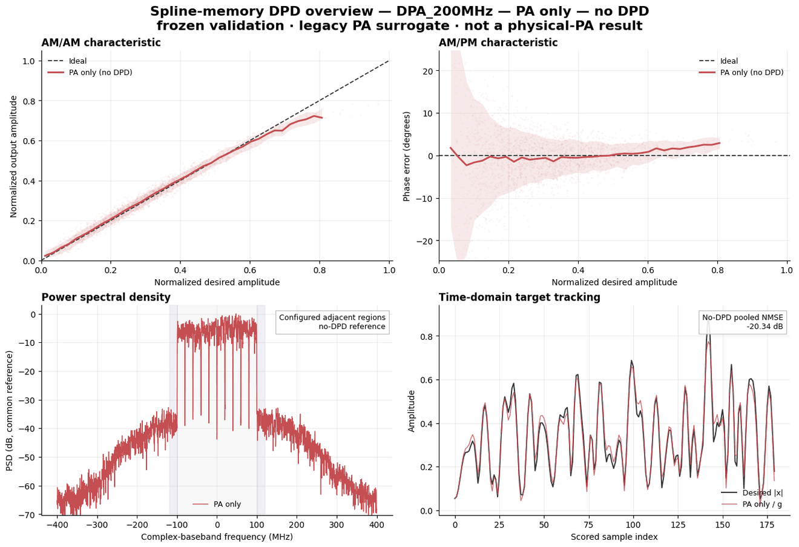
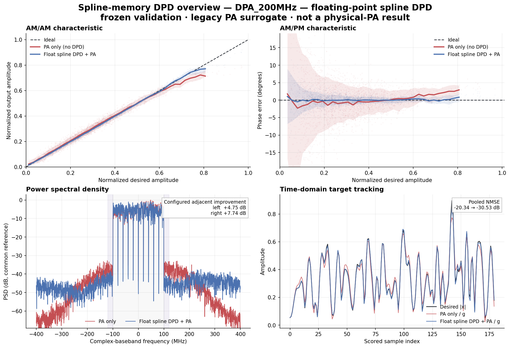
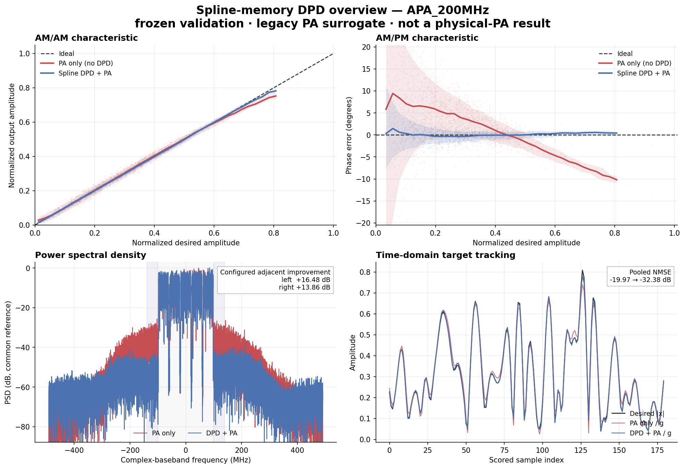
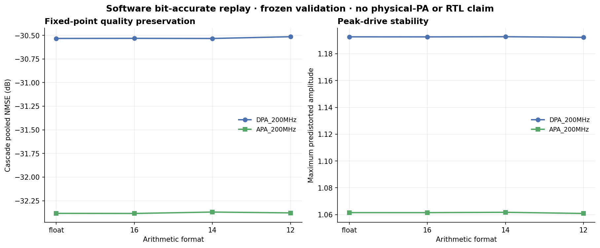
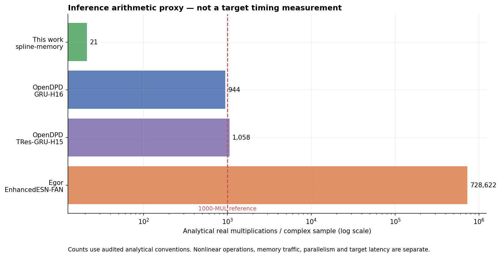

# Low-complexity phase-equivariant Digital Predistortion

В проекте разработан дешёвый причинный `spline-memory DPD`, проведён аудит
OpenDPD и reservoir-подхода Егора, построен воспроизводимый evaluation
pipeline и реализован bit-accurate software reference для 16/14/12-bit
inference.

> Главный результат текущего этапа: правильный
> `desired x -> DPD -> frozen PA surrogate -> y_hat; compare with g*x` тракт
> использует в deployed DPD core **21 real MUL + 24 real ADD + 1 magnitude +
> 6 LUT accesses на complex sample** и воспроизводимо уменьшает
> surrogate cascade error и мощность в заранее заданных adjacent regions.
> Это ещё не измерение на физическом PA и не заявление о соответствии Huawei.

## Статус за 30 секунд

| Компонент | Статус | Что это означает |
|---|---|---|
| Method, audit, code | ✅ готово | Реализован и протестирован phase-equivariant spline-memory fast path |
| One-command surrogate demo | ✅ готово | Fresh clone воспроизводит frozen validation results и hashes |
| Correct DPD direction | ✅ проверено | Вход DPD — desired signal `x`, а не измеренный `y_test` |
| Streaming inference | ✅ software reference | Проверена exact configured chunk equivalence с явным state |
| Fixed-point 16/14/12 bit | ✅ software reference | Bit-accurate integer arithmetic, saturation counters и phase checks |
| Physical PA replay | ⛔ не выполнено | Predistorted waveform ещё не измерен на одном calibrated DUT |
| Huawei harmonic/spur gate | ⛔ definition отсутствует | Не заданы RF bands, reference, threshold и measurement protocol |
| 1000-MUL-equivalent timing | ⛔ target отсутствует | Analytical count есть, но нет customer reference kernel/FPGA timing |
| Better than OpenDPD | ⛔ не доказано | Нет единого physical PA или общего frozen evaluator для двух DPD |

## Как работает модель



Animation переключает только реально сохранённые состояния:

```text
DPA: no DPD -> float spline DPD -> 12-bit spline DPD
APA: no DPD -> float spline DPD -> 12-bit spline DPD
```

Это **не animation обучения по epochs**. Spline coefficients получаются
закрытым complex ridge/least-squares решением, а представленные кадры читаются
из frozen validation artifacts. На всех PSD используется общая reference
power; каждая кривая не нормируется независимо.

Четыре панели показывают:

- `AM/AM` — насколько PA и cascade изменяют amplitude;
- `AM/PM` — phase error относительно ideal complex gain;
- `PSD` — spectral regrowth и изменение в configured adjacent regions;
- `time-domain tracking` — приближение выхода cascade к desired waveform.

Constellation намеренно не показана: raw complex OFDM samples образуют I/Q
cloud, но без зафиксированного validation-only demodulation contract это не
является корректной QAM constellation.

Короткий словарь evidence labels:

- `frozen surrogate` — зафиксированная и не дообучаемая программная модель PA;
- `reused validation` — validation split уже участвовал в историческом выборе
  float model, поэтому не считается untouched final test;
- `adjacent region` — заранее заданная соседняя baseband frequency band, а не
  автоматически настоящая RF harmonic около `2fc` или `3fc`.

## 1. Физическая задача

Исходный complex baseband signal:

$$
x[n] = I[n] + jQ[n].
$$

Идеальный PA должен формировать

$$
y_{ideal}[n] = g x[n],
$$

но реальный усилитель добавляет AM/AM, AM/PM, nonlinear distortion, spectral
regrowth и memory effects. Deployed path должен быть таким:

```text
desired x[n] -> DPD -> z[n] -> physical PA -> y[n] ~= g*x[n]
```

Принципиально неправильной final-проверкой является circular reconstruction:

```text
measured y_test/g -> inverse model -> estimated PA input
                  -> PA surrogate -> reconstruct measured y_test
```

Она проверяет согласованность inverse и forward models на уже известном
`y_test`, но не доказывает linearization нового desired signal. Наш основной
DPD evaluator такой circular path не использует.

## 2. Что известно о требованиях Huawei

По переданному уточнению научного руководителя подтверждено следующее:

1. Ограничение относится только к deployed DPD, а не к вспомогательному PA
   model/evaluator.
2. Основной quality criterion — attenuation паразитных harmonics/spurs после
   физического cascade `desired x -> DPD -> PA`.
3. «1000 real multiplications» — equivalent-time budget. Все MUL, ADD, DIV,
   nonlinear operations, LUT и memory traffic вместе должны выполняться не
   дольше customer reference из 1000 умножений.
4. Формула `E(f) < 10^-5` и формулы моделей на исходных slides являются
   иллюстративными и не используются как active acceptance gate.

Отдельно на предоставленных slides, которые не являются полной Huawei
specification, сформулированы strong nonlinear/memory modeling, удобство
real-time coefficient calculation, public self-verification и затем проверка
на real-world service data.

Пока неизвестны:

- что именно заказчик называет «harmonics»: компоненты около `2fc/3fc`,
  intermodulation, adjacent-channel regrowth или emission-mask violations;
- exact RF integration bands, RBW/FFT/window, dBc reference и threshold;
- DUT, carrier, bandwidth, power/backoff, waveform и required robustness axes;
- target FPGA/DSP/ASIC, clock, throughput, maximum latency и word lengths;
- reference implementation для 1000-MUL-equivalent timing;
- допустимое число calibration samples и update interval.

Поэтому текущие left/right numbers называются **configured complex-baseband
adjacent-region diagnostics**, а не Huawei RF-harmonic certification.

Полная матрица: [`REQUIREMENTS.md`](REQUIREMENTS.md).

## 3. Двухконтурная постановка

Проект разделяет две разные инженерные задачи.

### Contour A — PA system identification

```text
measured PA input x -> PA model -> y_hat
measured PA output y ----------------^ compare
```

PA model нужен как auxiliary evaluator и training instrument. На него не
распространяется DPD timing gate. Приоритеты здесь — fidelity, независимость и
правильный ranking DPD candidates.

### Contour B — deployed predistortion

```text
desired x -> low-latency DPD -> frozen independent evaluator / physical PA
          -> compare output with g*x and customer spectral mask
```

Именно Contour B принят как рабочая конечная задача проекта по уточнению
научного руководителя. Полной официальной Huawei specification у проекта нет.

## 4. Предложенная architecture

### Fast path — реализован

Текущая причинная трёхветвевая модель:

$$
z[n] = \sum_{m \in \{0,1,2\}} x[n-m] C_m(|x[n]|),
$$

где каждая $C_m(r)$ — complex piecewise-linear spline с quantile knots.

Основные свойства:

- на sample активны только две соседние basis functions;
- amplitude и phase корректируются одним complex coefficient field;
- отдельные произвольные I/Q networks не требуются;
- local support хорошо отображается в LUT/interpolator;
- обучение coefficients — convex complex least squares/ridge;
- state — короткая explicit delay line;
- inference причинный и streaming-compatible;
- структура сохраняет phase equivariance:

$$
D(xe^{j\phi}) = D(x)e^{j\phi}.
$$

### Slow path — proposed research stage

Следующее поколение системы предлагается сделать двухскоростным:

```text
sample-rate fast path:
    desired x -> small spline/GMP DPD -> PA

frame/event-rate slow path:
    observation receiver -> alignment -> residual observer
    -> recommend one coefficient update or one sparse branch
    -> shadow spectral validation -> apply / rollback
```

`Residual observer/advisor` пока является research proposal, а не частью
готового demo. Его задача — расходовать дополнительную complexity только на
структуру ошибки, реально подтверждённую независимым evaluator или physical PA.

## 5. Почему fast path использует 21, а не 1000 MUL

1000 MUL — upper timing bound, а не обязательная quota.

Текущий 21-MUL core является current low-cost reference point и оставляет
большой запас для
evidence-based extensions. Слепое расширение до 1000 операций сейчас было бы
методологически неверным:

- DPD residual уже близок к ошибке legacy PA surrogate;
- дополнительная model capacity может exploit surrogate error;
- complexity не гарантирует улучшение ACLR/spurs;
- лишние branches могут повысить peak drive/PAPR и ухудшить conditioning;
- фактический budget включает nonlinear operations и memory traffic.

План расходования запаса:

| Extension | Предварительная дополнительная стоимость | Когда добавлять |
|---|---:|---|
| Одна common-envelope spline branch | около 6 MUL/sample | Есть stable residual и PA-sensitivity evidence |
| Ещё одна selected memory branch | около 6 MUL/sample | Даёт independent spectral improvement |
| Short complex FIR | около 4–20 MUL/sample | Residual показывает linear frequency-selective memory |
| Sparse selected GMP groups | около 10–100 MUL/sample | Cross-memory подтверждена validation/physical PA |
| Tiny phase-equivariant residual NN | около 50–300 MUL/sample | Structured models исчерпаны |

## 6. Воспроизводимый surrogate result

Все результаты этого раздела относятся к historically reused validation split
и frozen legacy PA surrogate. DPA и APA — разные PA/captures и не смешиваются.

| Dataset | No-DPD pooled NMSE | Float-DPD pooled NMSE | Improvement | Adjacent-region improvement L/R |
|---|---:|---:|---:|---:|
| DPA_200MHz | -20.338 dB | -30.532 dB | +10.194 dB | +4.749 / +7.737 dB |
| APA_200MHz | -19.969 dB | -32.380 dB | +12.411 dB | +16.480 / +13.864 dB |

One-command demo сохраняет historical replay contract с four-sample PA
surrogate warm-up. Fixed-point/presentation protocol ниже использует более
консервативный six-sample cascade warm-up (`2 DPD + 4 PA`), поэтому для тех же
float waveforms получает `-30.533/-32.384 dB`. Разница меньше `0.004 dB`, но
два sealed protocols маркируются отдельно и не переписываются задним числом.

Main-region power изменилась примерно на `-0.052 dB` для DPA и `-0.041 dB`
для APA. Это важно: spectral improvement не получен простым сильным снижением
полезной output power.

На DPA за пределами заранее определённых adjacent regions blue DPD spectrum не
везде ниже red no-DPD spectrum. График намеренно это не скрывает: текущий claim
ограничен выделенными bands и не является утверждением о подавлении всего OOB
или RF harmonics.

<details>
<summary>Static DPA_200MHz overview</summary>



</details>

<details>
<summary>Static APA_200MHz overview</summary>



</details>

## 7. Fixed-point readiness



Bit-accurate integer reference проверяет input, coefficients, interpolation,
delay state, accumulators, rounding и saturation.

| Format | DPA cascade NMSE | DPA relative adjacent improvement L/R | APA cascade NMSE | APA relative adjacent improvement L/R |
|---|---:|---:|---:|---:|
| float | -30.533 dB | 4.749 / 7.737 dB | -32.384 dB | 16.480 / 13.864 dB |
| signed 16-bit | -30.532 dB | 4.746 / 7.736 dB | -32.385 dB | 16.470 / 13.865 dB |
| signed 14-bit | -30.534 dB | 4.742 / 7.725 dB | -32.370 dB | 16.494 / 13.829 dB |
| signed 12-bit | -30.515 dB | 4.731 / 7.641 dB | -32.379 dB | 16.328 / 13.941 dB |

В этой таблице все cascade NMSE используют одинаковый six-sample
`DPD + PA surrogate` warm-up, а все spectral columns используют одну и ту же
relative leakage improvement definition. Поэтому float и integer rows можно
сравнивать между собой.

Для всех шести fixed dataset/format combinations подтверждены:

- zero saturation и zero knot-code collision;
- exact configured chunked-streaming equivalence;
- bit-exact 90-degree phase-rotation equivariance;
- bounded peak-drive change.

Это software arithmetic evidence. Оно не означает, что 12 bit уже выбраны для
customer target, и не заменяет RTL/HLS equivalence, synthesis и timing closure.

## 8. Inference cost

Это analytical schedules на один complex sample:

| Schedule | MUL | ADD | DIV | Nonlinear | LUT | Compare DPA/APA | Reads/Writes | State |
|---|---:|---:|---:|---:|---:|---:|---:|---:|
| Float reference | 21 | 24 | 0 | 1 magnitude | 6 | 5 / 3 | 18 / 2 | 4 reals |
| Fixed integer | 20 | 25 | 1 | 1 integer sqrt | 8 | 5 / 3 | 28 / 2 | 4 reals |

Хранится 144 real coefficients для DPA и 48 для APA. Parameter count,
operation count и measured latency публикуются отдельно.



График использует audited raw real-MUL count. Для reservoir Егора отдельно
указаны 1,278 DIV; его ранее использованный normalized proxy равен примерно
728,622 multiplication-equivalents. Красная линия — только count reference,
а не pass/fail boundary. GRU дополнительно выполняет sigmoid/tanh и
state-memory traffic, а target FPGA может выполнять несколько multiplies
параллельно.

## 9. Сравнение с Егором, OpenDPD и Huawei gate

| Критерий | Наш spline-memory | Egor EnhancedESN_FAN | OpenDPD | Huawei acceptance |
|---|---|---|---|---|
| Честный DPD input | Всегда desired `x` | Cells 10/14 circular; cell 11 correct | DLA/ILA evaluation использует desired `x` | Desired waveform |
| Evidence | Reused validation, frozen legacy surrogate | Learned PA surrogate; mixed diagnostics | Repository surrogate + отдельная physical paper measurement | Physical PA measurement |
| Correct-direction DPA NMSE | -29.864 dB legacy test; -30.532 dB reused validation | -28.209 dB local notebook-path reproduction; другой gain/evaluator | Canonical table использует другой DPA_160MHz | Не задан как primary gate |
| Spectrum | Reproducible configured L/R regions | Correct ACLR/EVM отсутствуют; PSD protocol ошибочен | Repository ACLR и physical-paper ACPR | Customer-defined spurs/harmonics |
| DPD arithmetic/sample | 21 MUL | около 727,344 raw MUL + 1,278 DIV; normalized proxy около 728,622 | GRU-H16 944 MUL; TRes-GRU-H15 около 1058+ MUL | Полный equivalent-time budget |
| Nonlinear operations | 1 magnitude | 1200 tanh + 64 trig | GRU gates/features | Все входят во время |
| Streaming | Explicit state, exact chunk checks | `predict()` начинает с zero state | Зависит от backbone; frame resets/right context | Target contract неизвестен |
| Phase equivariance | Обеспечена архитектурой | Не гарантирована independent random I/Q models | Не гарантирована большинством neural backbones | Не задана, но физически полезна |
| Fixed point | Bit-accurate 16/14/12-bit software | Отсутствует | Main repo использует partial fake quantization | Target bit-true implementation |
| Допустимый вывод | Очень дешёвый surrogate Pareto point | Текущий code path не подходит по cost | Главный quality baseline | Ни один локальный метод ещё не прошёл physical gate |

### Метод Егора

Положительная сторона — convex ridge readout и наличие отдельного
correct-direction plot. Но основной notebook также использует circular
`y_test/g -> inverse -> PA surrogate -> y_test` diagnostics.

Ключевые ограничения текущего `EnhancedESN_FAN`:

- dense `W @ state`, несмотря на sparse initialization;
- около 727,344 raw real MUL, 1,278 DIV, 726,152 ADD, 1200 tanh и
  64 sin/cos на sample; normalized multiplication-equivalent proxy — около
  728,622;
- даже идеализированный CSR estimate остаётся около 80,410 MUL/sample;
- обычный `predict()` сбрасывает hidden state;
- independent random I/Q models не обеспечивают phase equivariance;
- исходный PSD использует `fs=200`, `nperseg=256` вместо 800 MHz/2560;
- validation, fixed-point и reproducible timing logs отсутствуют.

Local notebook-path result сохранён в
[`experiments/results/egor_reproduction_dpa200.json`](experiments/results/egor_reproduction_dpa200.json).
Числа нельзя ранжировать как quality gain: PA surrogates, gain protocols и
evaluation paths различаются.

Подробный audit: [`research/egor_pipeline_audit.md`](research/egor_pipeline_audit.md).

### OpenDPD

OpenDPD — основной quality baseline. В нём правильно разделены PA modeling и
DPD direct learning:

```text
desired x -> neural DPD -> frozen differentiable PA -> y_hat
                                                    -> compare with g*x
```

У OpenDPD есть развитый test suite: 93 declared test functions под `tests/`
плюс шесть installation checks и parameterization. CI проверяет metrics,
datasets, API/CLI, backbones, checkpoint
creation, quantization-aware path и короткий end-to-end
`train_pa -> train_dpd -> run_dpd -> plot`. Weekly job расширяет smoke на
datasets/backbones.

Но smoke tests в основном требуют finite metrics и наличие artifacts. Они не
доказывают published RF quality. Quality numbers находятся в отдельном
benchmark и статье.

Canonical APA_200MHz repository benchmark сообщает:

| DPD | Test NMSE | Test repository-EVM | Test ACLR average |
|---|---:|---:|---:|
| MP | -42.19 dB | -48.15 dB | -45.19 dB |
| GMP | -38.53 dB | -46.35 dB | -43.59 dB |
| GRU-H16 | -45.13 dB | -47.43 dB | -51.01 dB |
| TRes-GRU-H15 | -44.29 dB | -45.10 dB | -53.49 dB |

Эти results проходят через OpenDPD TRes-GRU PA surrogate. Наш demo использует
legacy MP surrogate, другой gain protocol и pooled NMSE. Поэтому raw numbers
нельзя использовать как прямую турнирную таблицу.

В physical experiment статьи OpenDPDv2 TRes-DeltaGRU сообщает примерно
`-39.6 dB NMSE`, `-42.1 dB EVM` и `-59.9 dBc ACPR` против `-20.5/-24.7/-28.3`
без DPD. Это сильнейший physical evidence layer среди рассматриваемых работ,
но corresponding raw captures/checkpoints/bit-true hardware artifacts не входят
в current checkout.

Подробный audit: [`research/opendpd_audit.md`](research/opendpd_audit.md).

## 10. Что доказано, а что нет

### Доказано кодом и frozen artifacts

- correct desired-input DPD direction;
- deterministic train/validation/test contracts и no-test demo access;
- one-command reproducibility с 13 completion manifests;
- float spline-memory streaming inference;
- analytical operation/storage vectors;
- validation-only surrogate NMSE и adjacent-region improvement;
- software bit-accurate 16/14/12-bit preservation;
- zero saturation/collision на evaluated signals;
- exact configured chunks и 90-degree phase equivariance;
- two-epoch OpenDPD training-state `SIGKILL`/resume equivalence smoke для
  model, optimizer, scheduler, history и RNG; это не validation-quality
  checkpoint.

### Доказано только на surrogate

- linearization quality текущего spline DPD;
- AM/AM, AM/PM и PSD improvements;
- fixed-point cascade preservation;
- comparison с reproduced Egor path;
- любые conclusions, заканчивающиеся на learned PA evaluator.

### Пока не доказано

- customer-defined RF harmonic/spur attenuation;
- linearization одного physical PA нашим DPD;
- better-than-OpenDPD на одном DUT/evaluator;
- target timing, throughput, power, area и RTL resources;
- достаточность 12/14/16 bit на physical PA;
- robustness по power, waveform, temperature, bias, aging и load;
- безопасный online observer/advisor apply/rollback.

## 11. One-command reproduction

### Surrogate demo

```bash
git clone --recurse-submodules https://github.com/theJorDea/DPD.git
cd DPD
python3 -m venv .venv
.venv/bin/python -m pip install -r requirements-baseline.txt
PYTHONDONTWRITEBYTECODE=1 .venv/bin/python -m experiments.run_surrogate_demo \
  --output-root experiments/results/surrogate_demo_local_01
```

`--output-root` должен быть новым, ещё не существующим каталогом. Это защищает
старые evidence bundles от незаметной перезаписи.

Ожидаемый финал:

```text
DPA_200MHz: NMSE -20.338 -> -30.532 dB; adjacent relative L/R +4.749/+7.737 dB
APA_200MHz: NMSE -19.969 -> -32.380 dB; adjacent relative L/R +16.480/+13.864 dB
PASS: validation-only surrogate demo; no physical-PA claim
```

### Presentation assets

```bash
.venv/bin/python -m pip install -r requirements-presentation.txt
PYTHONDONTWRITEBYTECODE=1 .venv/bin/python \
  -m experiments.generate_presentation_assets \
  --output-dir /tmp/dpd_presentation_reproduction
```

Visualizer:

- проверяет completion manifests и SHA-256 каждого input artifact;
- не открывает measured validation/test output;
- не выполняет fit, selection, retuning или model evaluation;
- строит PNG/GIF только из frozen waveform/PSD arrays;
- записывает source/output hashes в `presentation_manifest.json`;
- отказывается изменять output directory с неизвестными файлами.

### Tests

```bash
PYTHONDONTWRITEBYTECODE=1 .venv/bin/python -m unittest discover -s tests -v
```

Последний full NumPy-environment audit: `353` tests passed, `8` ожидаемо
skipped из-за отсутствия locked PyTorch/OpenDPD environment. Отдельный locked
OpenDPD integration/resume suite: `47` tests passed. Это software correctness
evidence, а не RF-quality measurement.

## 12. Следующий решающий эксперимент

На одном calibrated physical PA и одном operating point необходимо подать один
и тот же desired waveform:

```text
1. no DPD
2. OpenDPD reference
3. spline-memory DPD
```

До запуска необходимо заморозить:

- customer spectral bands/reference/threshold;
- gain, integer/fractional delay и feedback-path equalization;
- waveform, sample rate, output power/backoff и capture length;
- left/right/worst-bin/integrated-OOB metrics;
- EVM, NMSE, main power, peak, PAPR и clipping gates;
- target timing kernel, word lengths и streaming contract.

После measurement выполняется residual analysis. Добавляется максимум одна
cheap branch, если она улучшает independent spectral shadow result и проходит
peak/PAPR/timing gates. Предыдущий known-good coefficient bank сохраняется для
rollback.

## Итог

Текущий проект не пытается выиграть leaderboard количеством parameters. Он
строит Pareto solution:

```text
maximum independently verified spectral suppression
subject to bounded peak/PAPR, causal streaming, fixed-point stability
and customer-equivalent execution time below the 1000-MUL reference.
```

На текущем evidence layer spline-memory DPD является очень дешёвым и
воспроизводимым surrogate baseline. Для утверждения «лучше OpenDPD» или
«соответствует Huawei» остаются обязательными один physical PA,
apples-to-apples spectral measurement и target-specific timing.
